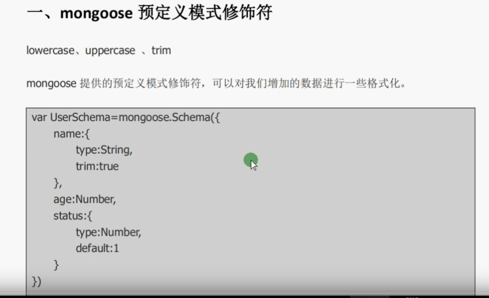

# mongoose修饰符

## 1、预定义修饰符

##### 1.1、预定义修饰符



##### 1.2、索引


```bash
//第一种方式
var UserSchema = mongoose.Schema({
	name:{
		type:String,
		//唯一索引,
		//unique:true,
		//普通索引
		index:true
	}
})

//第二种方式
UserSchema.index({ name: 1 });
UserSchema.index({ name: -1 });
```

## 2、自定义修饰符  （不能和预修饰一起用。可能会出现不可靠的情况）

```bash
var UserSchema = mongoose.Schema({
	name:{
		type:String,
		set(val){
			return val.trim()
		}
	}
})
```

