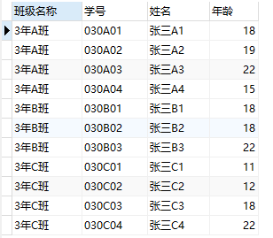
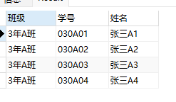
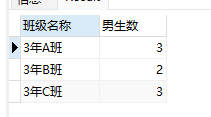
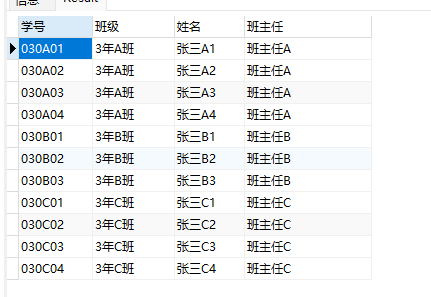
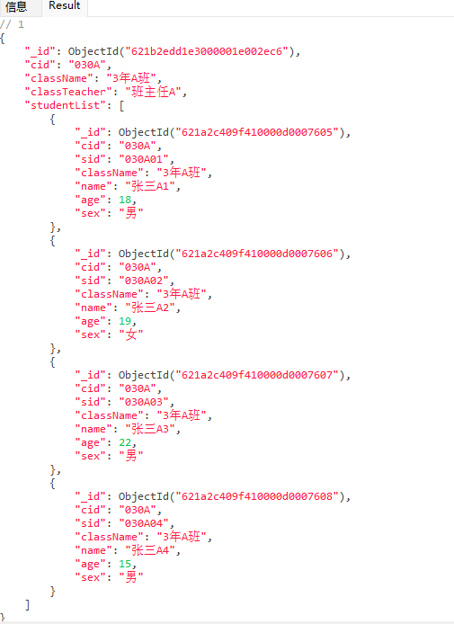

# mongodb多表查询

## 1、模拟数据

```bash
//创建一个新数据库 school
use school

//创建班级数据
db.banji.insert({"cid":"030A","className":"3年A班","classTeacher":"班主任A"})
db.banji.insert({"cid":"030B","className":"3年B班","classTeacher":"班主任B"})
db.banji.insert({"cid":"030C","className":"3年C班","classTeacher":"班主任C"})
db.banji.insert({"cid":"030D","className":"3年D班","classTeacher":"班主任D"})

//创建学生数据
db.student.insert({"cid":"030A","sid":"030A01","className":"3年A班","name":"张三A1","age":18,"sex":"男"})
db.student.insert({"cid":"030A","sid":"030A02","className":"3年A班","name":"张三A2","age":19,"sex":"女"})
db.student.insert({"cid":"030A","sid":"030A03","className":"3年A班","name":"张三A3","age":22,"sex":"男"})
db.student.insert({"cid":"030A","sid":"030A04","className":"3年A班","name":"张三A4","age":15,"sex":"男"})
db.student.insert({"cid":"030B","sid":"030B01","className":"3年B班","name":"张三B1","age":18,"sex":"男"})
db.student.insert({"cid":"030B","sid":"030B02","className":"3年B班","name":"张三B2","age":18,"sex":"女"})
db.student.insert({"cid":"030B","sid":"030B03","className":"3年B班","name":"张三B3","age":22,"sex":"男"})
db.student.insert({"cid":"030C","sid":"030C01","className":"3年C班","name":"张三C1","age":11,"sex":"男"})
db.student.insert({"cid":"030C","sid":"030C02","className":"3年C班","name":"张三C2","age":12,"sex":"男"})
db.student.insert({"cid":"030C","sid":"030C03","className":"3年C班","name":"张三C3","age":18,"sex":"男"})
db.student.insert({"cid":"030C","sid":"030C04","className":"3年C班","name":"张三C4","age":22,"sex":"女"})
```

## 2、设置别名 正常查询班级表 并给查询名称添加中文名称



```bash
use school
db.getCollection("student").aggregate([
	{
		$project: {
			_id:0,
			"班级名称":"$className",
			"学号":'$sid',
			"姓名":'$name',
			"年龄":'$age'
		}
	}
])

```

## 3、增加条件




```bash
db.getCollection("student").aggregate([{
    $match: {
        cid: "030A"
    }
}, {
    $project: {
        _id: 0,
        "班级": "$className",
        "学号": "$sid",
        "姓名": "$name"
    }
}])
```

## 4、计数



```bash
db.getCollection("student").aggregate([{$match:{
    sex: "男"
}}, {$group:{
    _id: {
        "className": "$className"
    },
    count: {
        $sum: 1
    }
}}, {$project:{
    _id: 0,
	"班级名称":"$_id.className",
    "男生数": "$count"
}}])
```

## 5、多表合并1



```bash
db.getCollection("student").aggregate([{
    $lookup: {
        from: "banji",
        localField: "cid",
        foreignField: "cid",
        as: "banji"
    }
}, {
    $project: {
        _id: 0,
        学号: "$sid",
        "班级": "$className",
        "姓名": '$name',
        班主任: {
            $arrayElemAt: ["$banji.classTeacher", 0]
        }
    }
}])
```

## 6、多表合并2



```bash
db.getCollection("banji").aggregate([{
    $match: {
        cid: "030A"
    }
}, {
    $lookup: {
        from: "student",
        localField: "cid",
        foreignField: "cid",
        as: "studentList"
    }
}])
```